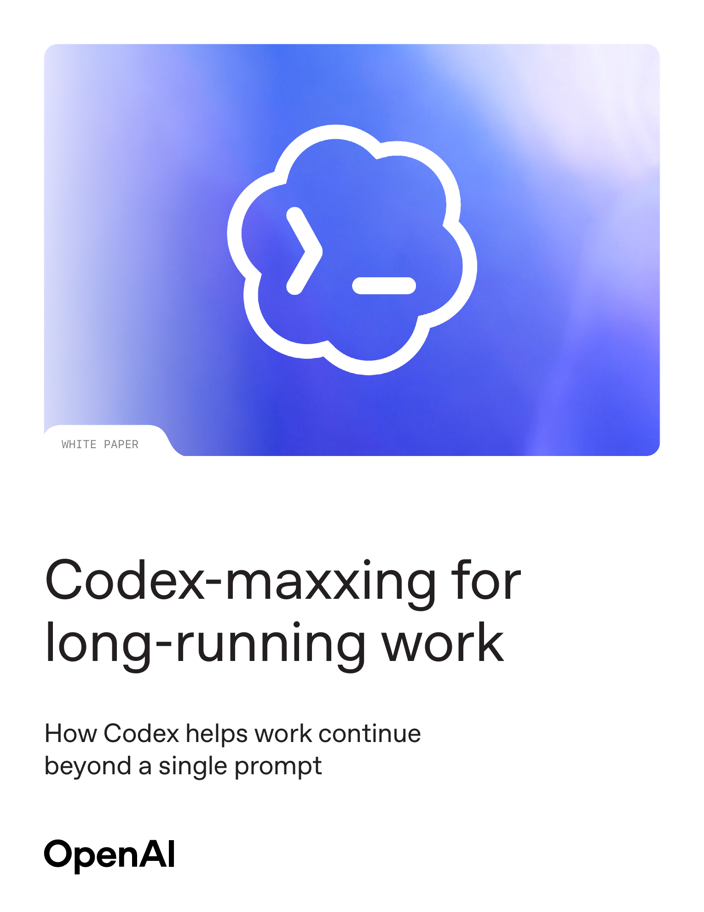
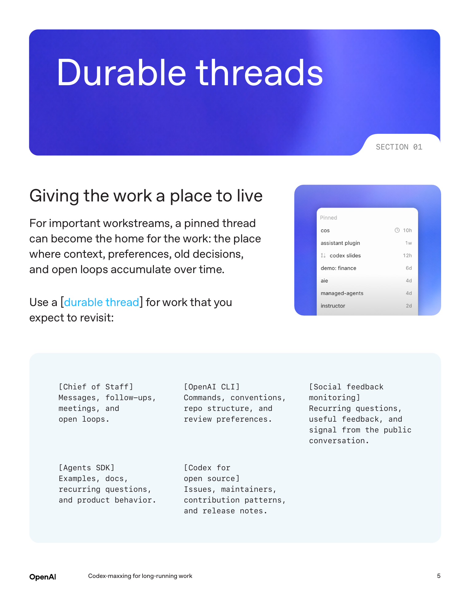
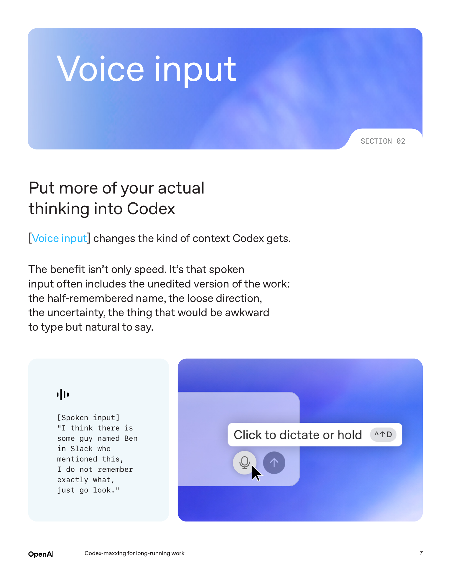
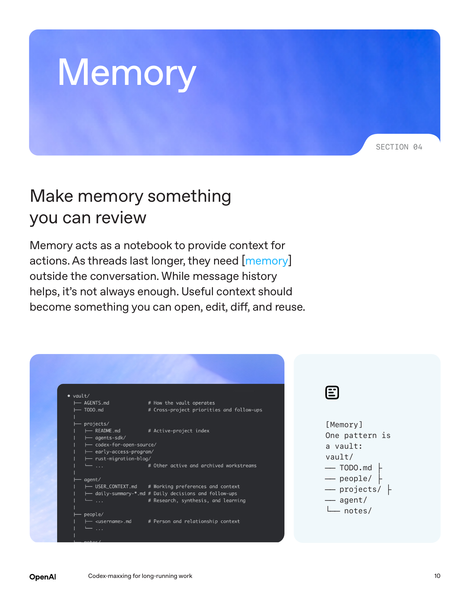
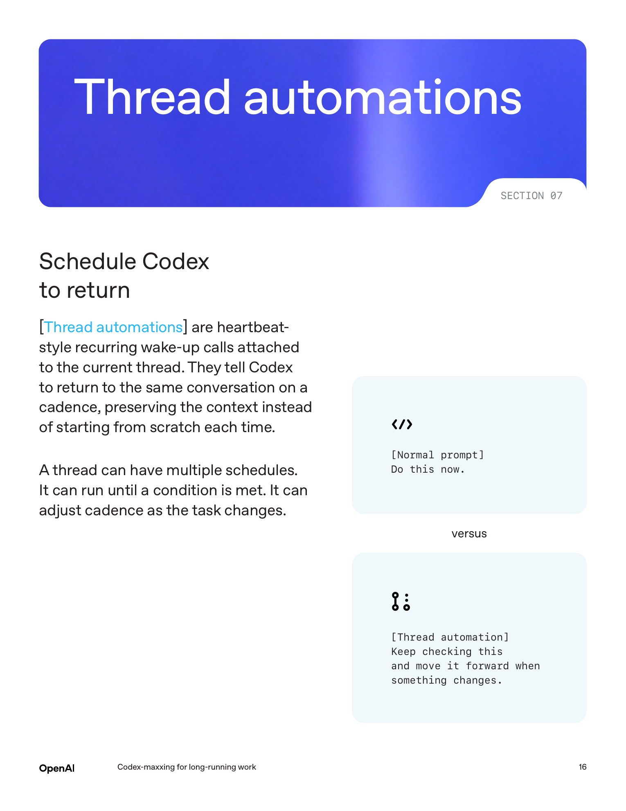
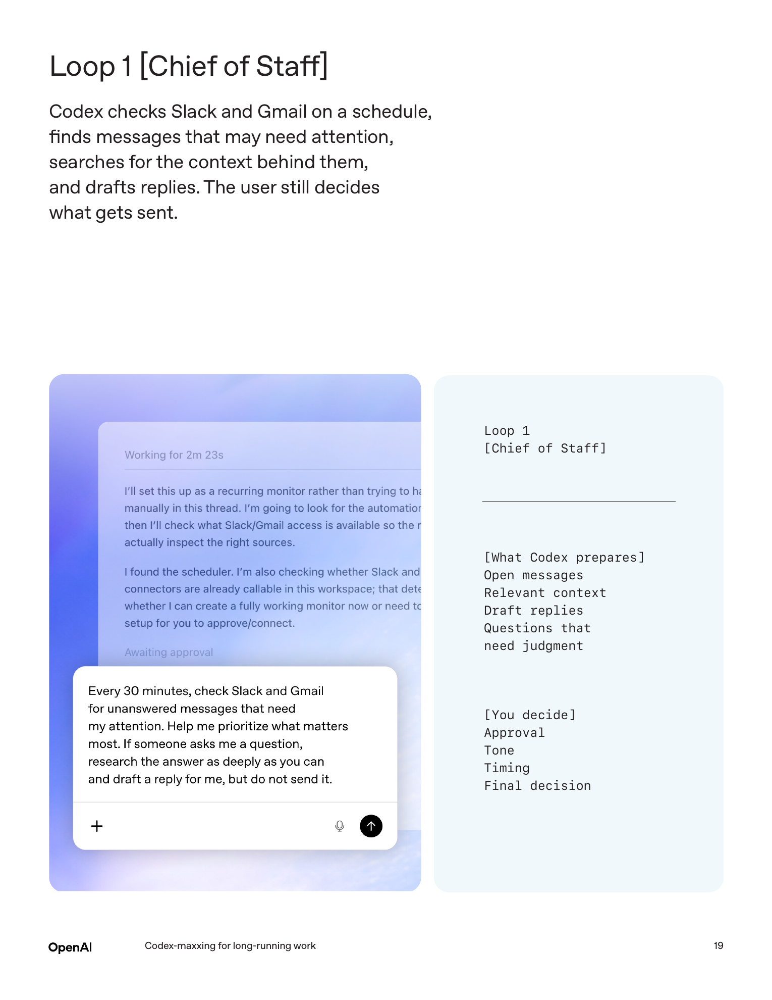
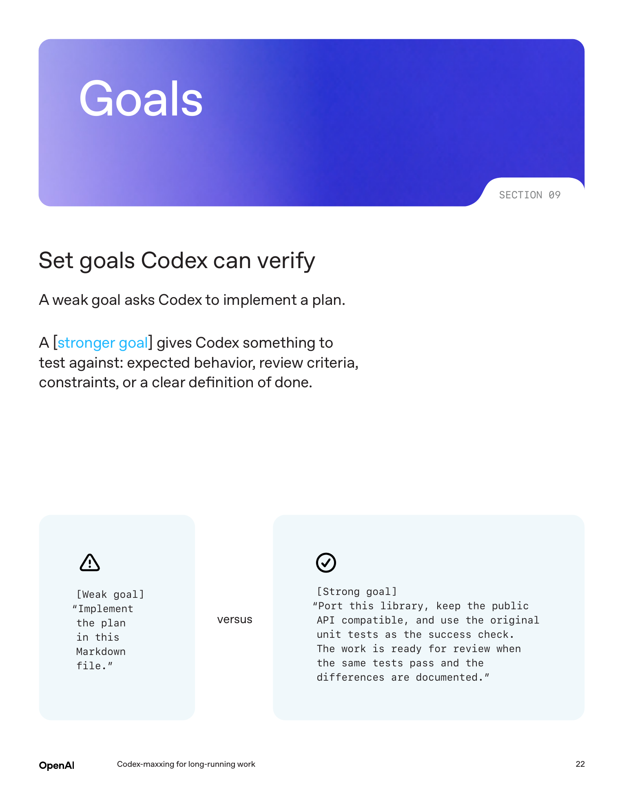
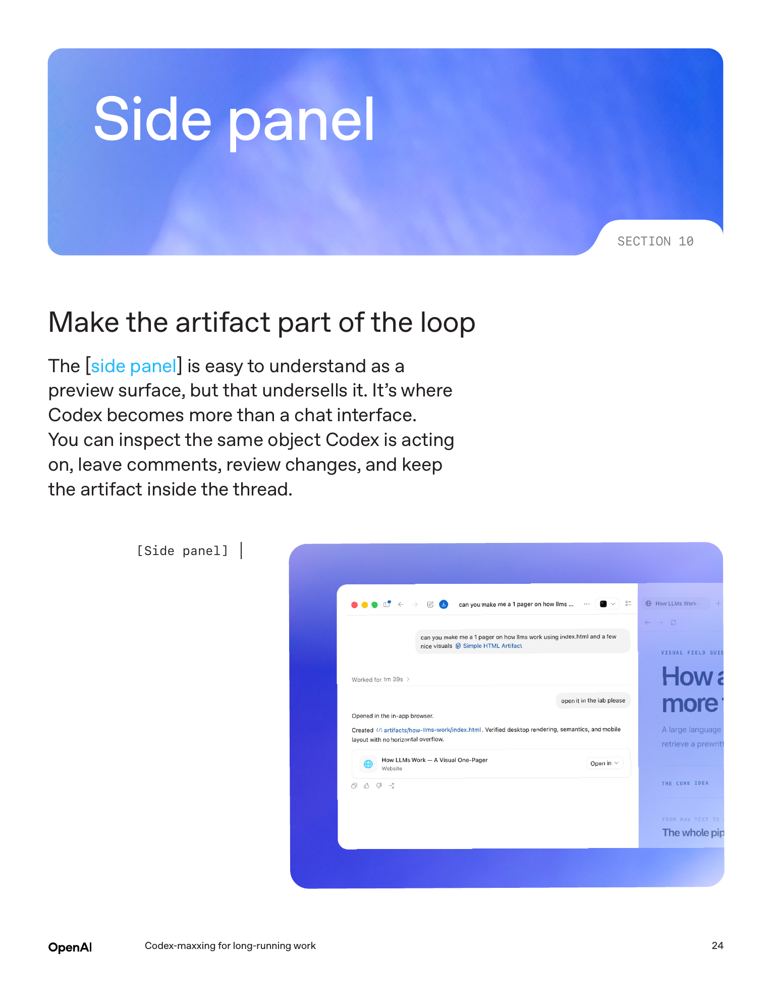

# OpenAI 这份 Codex-maxxing 白皮书，别再把 Agent 当一次性 prompt 用了

[English](../../en/ai-articles/01-agent-and-coding/codex-maxxing-stop-using-agents-as-one-shot-prompts.md) | [中文](./OpenAI%20%E8%BF%99%E4%BB%BD%20Codex-maxxing%20%E7%99%BD%E7%9A%AE%E4%B9%A6%EF%BC%8C%E5%88%AB%E5%86%8D%E6%8A%8A%20Agent%20%E5%BD%93%E4%B8%80%E6%AC%A1%E6%80%A7%20prompt%20%E7%94%A8%E4%BA%86.md)

> 日期：2026-06-23

OpenAI 2026 年 6 月 22 日发了一份新白皮书。

名字有点怪，叫 `Codex-maxxing for long-running work`。

我第一眼以为又是一份 Codex 使用技巧合集。看完之后，感觉它讲的其实更直接：

**OpenAI 想让大家把 Codex 从一次性问答工具，改成长期任务的工作现场。**

这事跟写不写代码都有关系。

白皮书开头先承认，Codex 本来就是为 coding work 做的：改 repo、做 diff、review、帮助发版。

但是后面的重点变了。OpenAI 说，当 Codex 有 durable thread、shared memory、tools、recurrence，还有一个能 review 产物的地方，工作就能跨过一次 prompt 继续往前走。

这句话翻译成人话就是：

别再只问“帮我写一下”。

你要让 Agent 记住这条工作线，定期回来，看上下文，改产物，然后等你做判断。



*图源：OpenAI 官方白皮书，本地 PDF 渲染截图*

---

## 给工作一个住处

这份白皮书里，我最在意的是 durable thread。

automation 和 side panel 都重要，但 durable thread 是底座。

OpenAI 举了几个例子：社交反馈监控、开源项目维护、OpenAI CLI、Agents SDK、Chief of Staff。

这些任务都有一个共同点：今天做不完，明天还要回来。

比如一个开源项目的维护，不是今天让 Codex 修一个 issue 就结束。它可能要长期看 issue、看 release note、看贡献模式、记住 maintainer 的偏好，再在合适的时候准备 PR。

如果每次都新开一个线程，前面的判断和上下文就断了。

所以白皮书说，重要 workstream 可以有一个 pinned thread。

这个线程就是这件事的家。上下文、偏好、旧决策、open loop，都往这里放。



*图源：OpenAI 官方白皮书，本地 PDF 渲染截图*

当然，这里有代价。

长线程带着更多 context，运行成本可能比短线程高。

OpenAI 没有把这事包装成免费午餐。它的判断很朴素：重要任务值得为连续性多付一点成本。

这点我挺认同。

很多 Agent 任务失败，问题经常出在中段：它忘了自己为什么这么做。

人类也一样。一个项目如果没有固定地方记录背景、决策和下一步，过两天回来也会懵。

Codex 只是把这个问题放大了。

---

## 语音输入的价值，不在快

白皮书第二个点讲 voice input。

这个地方挺有意思。

很多人理解语音输入，就是打字慢，所以用嘴说。

但 OpenAI 讲的是另一件事：语音会带进更真实的想法。

比如你可能会说：

> 我记得 Slack 里有个叫 Ben 的人提过这事，但我不太确定，你去找找。

这种话你打字时很可能会删掉，因为它不够正式，不够完整。

但真实工作就是这么开始的。

半记得的人名、模糊的方向、不确定的判断、临时想起来的细节，这些东西反而是 Agent 很需要的上下文。



*图源：OpenAI 官方白皮书，本地 PDF 渲染截图*

我现在越来越觉得，给 Agent 的上下文不能太“干净”。

太干净的 prompt 很像考试题。边界明确，材料完整，答案也相对单一。

但是工作现场不是这样。

工作现场经常是一堆半成品信息：会议里提过一句，Slack 里有人吐槽过，代码里有个历史注释，客户上次没明说但明显不满意。

人脑会把这些碎片捏起来。

Agent 也需要这些碎片。

所以 voice input 真正的价值，是把你脑子里那坨还没整理好的东西先倒出来。

后面再让 Codex 把它变成计划、草稿、产物和下一步动作。

---

## Memory 要能被 review

白皮书里有一页专门讲 memory。

它给了一个很简单的结构：

```text
vault/
  TODO.md
  people/
  projects/
  agent/
  notes/
```

这个结构不复杂，但方向很对。

OpenAI 的意思是，长线程不能只靠聊天历史。真正有用的上下文，应该变成你能打开、编辑、diff、复用的东西。



*图源：OpenAI 官方白皮书，本地 PDF 渲染截图*

这里有个边界很重要。

代码仓库放代码。

vault 放工作上下文。

这个上下文包括人、决策、open loop、daily note、项目状态，还有那些过两天就会忘的细节。

如果 vault 放在 GitHub 里，diff 就变成了 memory 的 review surface。

你能看到 Codex 觉得什么东西重要到需要写下来。

这一步非常关键。

因为长任务最怕的是记忆自己偷偷长歪。

Agent 在聊天里记了一堆模糊印象，后面又拿这些印象去做判断，这事很危险。

更好的做法是让它写下来。

谁偏好什么，哪个项目在等谁，哪个决策已经定了，哪个 loop 已经关了。

写成文件，就能 review。

能 review，才敢长期跑。

---

## 真正的长任务，靠循环

看到 thread automations 这一节，我第一反应是：这已经超过普通提醒了。

白皮书把它叫 heartbeat-style recurring wake-up calls。

简单讲，就是让 Codex 定期回到同一个线程里，按照同一套上下文继续看事。

普通 prompt 是“现在做这个”。

thread automation 是“每隔一段时间回来看看，如果变了，就往前推一步”。



*图源：OpenAI 官方白皮书，本地 PDF 渲染截图*

白皮书给了一个很具体的例子：

每 30 分钟检查 Slack 和 Gmail，找有没有需要回复的消息，研究上下文，起草回复。

但是不要直接发送。

这就把 Agent 和人的分工讲清楚了。

Codex 做准备工作：找消息、补上下文、写草稿、提出问题。

人做判断：批不批准，用什么语气，什么时候发，最后怎么决定。



*图源：OpenAI 官方白皮书，本地 PDF 渲染截图*

这个边界不能省。

很多人一说 Agent 自动化，就容易想成完全自动跑。

白皮书里的例子反而很克制。

Chief of Staff loop 里，人决定 approval、tone、timing、final decision。

退款跟进 loop 里，人决定 consent、approval、any irreversible action。

我觉得这才是比较现实的用法。

让 Agent 把材料准备到你可以决策的位置。

不可逆动作前，人必须出现。

---

## 强 goal 是底线

这份白皮书后半段讲 goals。

这个点和我平时用 Codex 的体感基本一致。

弱 goal 是：

```text
Implement the plan in this Markdown file.
```

听起来有任务，但没有验收线。

强 goal 会给 Codex 一个能测试的标准：预期行为、review criteria、约束条件，或者明确的 definition of done。



*图源：OpenAI 官方白皮书，本地 PDF 渲染截图*

白皮书举了一个 Rich-to-Rust 的例子。

目标要更具体：迁过去之后，还能通过原来的单元测试。

原测试集就是验收标准。

这事非常工程化。

没有验收线的 Agent，很容易显得很努力。

它会查文件、改代码、生成说明、讲一堆理由。

但你最后会发现，它只是一直在动，并不一定在靠近完成。

我现在给 Codex 写任务，也会尽量加这几句话：

```text
完成标准：
- 原有行为不变。
- 对应测试通过。
- 不改无关模块。
- 输出改动文件、验证命令和失败尝试。
```

这不是形式感。

这是在告诉 Agent 什么时候该停。

---

## Side panel 把产物拉进循环

白皮书最后讲 side panel。

这个地方我比较在意。

因为它解决的是 Agent 产品里一个很现实的问题：你不能永远在聊天框里 review 工作。

Markdown、表格、CSV、PDF、slides、网页、Jupyter，这些东西本来就是有形态的。

它们不应该被压扁成一段聊天记录。



*图源：OpenAI 官方白皮书，本地 PDF 渲染截图*

side panel 的价值是，你和 Codex 可以看同一个东西。

你在产物上留评论，评论变成指令。

你在浏览器里看一个 `index.html`，Codex 改它。

你在表格里看公式和单元格，Codex 改它。

你在 slide 里看排版，Codex 改它。

这和单纯聊天差别很大。

聊天框适合分配任务。

side panel 更适合把任务做完。

OpenAI 这份白皮书里有一句判断挺准：side panel 是 Codex 开始成为工作发生地的地方。

这也是我觉得 Codex 后面最值得观察的地方。

后面要看这些产物 review surface 能不能真的顶住日常工作。

---

## 所以这篇白皮书到底在说什么

我看完之后的总结很简单：

**OpenAI 正在把 Codex 从“执行一次任务”，推向“守住一条长期任务线”。**

这里面有四个要素。

稳定线程，让工作有住处。

可 review 的 memory，让上下文别偷偷长歪。

可验证的 goal，让 Agent 知道什么时候完成。

不可逆动作前的人工确认，让自动化有边界。

这四件事凑在一起，Codex 才像一个长期协作者。

单次 prompt 当然还会存在。

但越重要的工作，越不能靠单次 prompt。

你要让它记住为什么做，知道下一步做什么，能回来继续，能把产物放到你面前让你 review。

到最后，人不用每次从零开始解释。

Agent 也不用每次从零开始猜。

这应该就是 Codex-maxxing 这个怪名字背后的意思。

Codex-maxxing 的核心，是把工作本身组织得更适合 Agent 接住。

---

## 资料来源

- OpenAI 官方页面：[Codex-maxxing for long-running work](https://openai.com/index/codex-maxxing-long-running-work/)，发布于 2026 年 6 月 22 日。
- OpenAI 官方 PDF：[OAI_WhitePaper_Codex-maxxing26.pdf](https://cdn.openai.com/pdf/8a9f00cf-d379-4e20-b06f-dd7ba5196a11/OAI_WhitePaper_Codex-maxxing26.pdf)。
- 本文配图来自白皮书页面截图整理，原 PDF 见上方链接。
