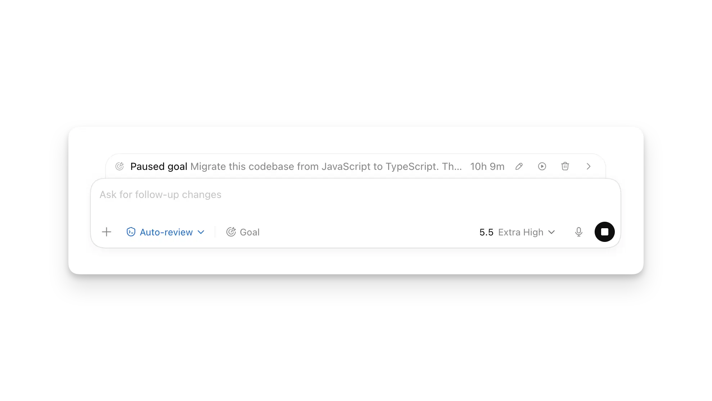
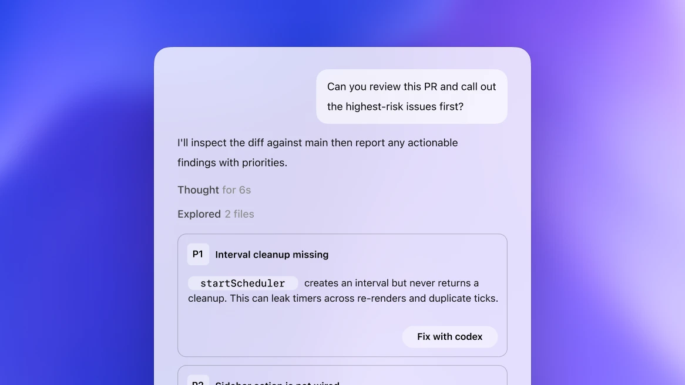
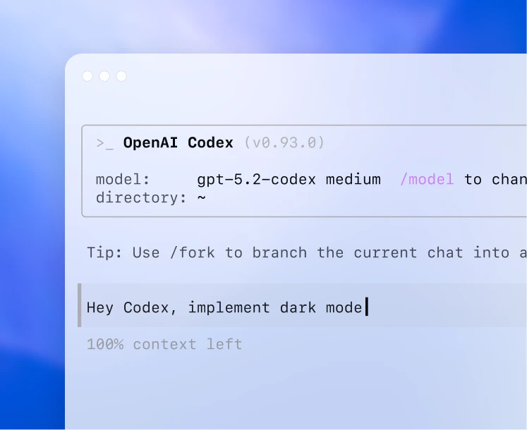

# 我最近最常用的 10 个 Codex 技巧

> 日期：2026-06-09


这两天我发现一个问题。

Codex 我用得越多，越不想让它一上来就改代码。

最开始我的用法很直接：打开 Codex，输入一句“帮我实现一下”，然后等它改代码。

现在不是这样了。

现在我会先让它把计划说清楚，再调整权限。跑完一轮后，再看 diff、页面和测试结果。

原因也简单：这样很容易返工。

现在大家应该都不在怀疑 Agent 能力了，存疑的是 Agent 会不会能力太强，改动太大。

你让它改一个按钮，它可能额外整理 import、改公共组件，把一个小问题带成一次小重构。

这样就造成额外的不必要的工作量。

这篇我讲一下我自己最常用、也确实能减少返工的 10 个技巧。



*图源：OpenAI Codex app commands 文档，searchnews 已本地保存*

---

## 先让它出计划

第一个技巧是 `/plan`。

这个命令我现在基本会在两类场景里先用：跨文件修改，或者我自己还没完全想清楚的需求。

以前我经常直接说“帮我改一下”。Codex 很快就会开始修改。

问题是，修改开始得越快，越容易跳过边界确认。

因为它还没讲清楚三件事：准备改哪里，怎么验证，哪些地方不能碰。

我现在常用的提示词大概是这样：

```text
先不要改代码。

请先读相关文件，给我一个计划：
1. 要改哪些文件。
2. 哪些地方不碰。
3. 改完怎么验证。
4. 这件事最容易出问题的点是什么。
```

这一步会多花一点时间，但能减少后面的返工。

你会很快发现它有没有理解错需求，有没有准备动一个不该动的模块，有没有把验证写成一句没有依据的“应该没问题”。

**Agent 写代码越快，开工前那一分钟越应该花。**

第二个技巧是 `/goal`。

这个适合长任务，比如迁移、重构、批量修复、整理一堆历史问题。

但我现在不会直接写“把这个项目优化一下”。

这种 goal 太宽泛，执行过程中容易偏离目标。它会一直推进，但你不知道它到底离完成标准还有多远。

我会给它一个终点线：

```text
目标：把这个模块从旧接口迁移到新接口。

完成标准：
- 相关单测全部通过。
- 页面原有行为不变。
- 不改认证逻辑。
- 收尾输出改动文件、验证命令和失败尝试。
```

没有验证方式的 goal，很容易偏离目标。

我之前跑过很长的任务，跑到后面 Codex 的回复结构还正常，但方向已经偏了。后来我就养成一个习惯：goal 跑一段，就让它停下来复盘一次计划。

问它：现在离终点还差什么？原来的边界有没有被突破？下一步准备干什么？

这一步的作用很具体：定期对齐任务状态，防止长任务偏离原始目标。

我之前还写过一篇 goal 的用法，你可以看看这篇 [可算是把 goal 玩明白了。](https://mp.weixin.qq.com/s/t4uLnRohUmrcCRJthH-PHw)

---

## 权限按风险给

第三个技巧是 `/permissions`。

这个我以前也踩过两个坑。

一种是权限过窄，什么都问，Codex 频繁中断。另一种是直接给 full access，改动范围很快变大，事后 diff 很难审。

现在我会按任务切权限。

读代码、查资料、梳理方案，可以宽一点。

要写文件、装依赖、跑迁移、动配置，就收紧。

如果是支付、权限、数据库迁移、安全配置，我宁愿它多问几次。这里多确认一次，比让高风险改动绕过确认更稳。

Codex 现在的权限配置已经能细到文件系统、workspace root、网络域名，甚至能把 `.env` 这类文件直接 deny 掉。

第四个技巧是 `AGENTS.md`。

这个文件不要写空泛要求。

不要写“请保持代码优雅”“请遵循最佳实践”。这种话约束很弱，也不方便后面检查。

我会写这种：

```md
## Verification

- 修改前端后，要启动本地服务并打开目标页面。
- 修改 API 行为后，要跑对应测试。
- 不主动重构未涉及模块。

## Review

- Code review 只报告真实风险，不报风格偏好。
- 不确定的事实要标注不确定，不要乱补。

## Safety

- 不读取、不修改 `.env`。
- 不改认证、支付、权限逻辑，除非任务明确要求。
```

Codex 会在开工前读 `AGENTS.md`。全局可以放在 `~/.codex/AGENTS.md`，项目里也可以放一个更具体的。

我更建议把它当成工作协议，不要当成偏好合集。

第五个技巧是 hooks。

有些规则不能只靠提示词。

比如不要改 `.env`，不要跑危险命令，改完某类文件自动跑 lint。这些事情，靠 prompt 约束并不稳。

该强制执行，就写 hook。

Codex 的 hooks 可以插进 agentic loop 里，在工具调用前后、线程开始、子任务启动这些节点触发脚本。非托管 hook 还要 review 和 trust 之后才会跑，这个设计挺合理。

我现在对 hooks 的理解是：`AGENTS.md` 负责写规则，hooks 负责在关键节点做校验。

一个是规则。

一个是校验。

前者告诉 Codex 怎么做，后者检查它有没有越过边界。

---

## 审查前置

第六个技巧是 `/diff`。

这个命令不显眼，但用习惯之后，能明显降低 review 成本。

如果你一直用 xhigh，Codex 的改动范围很容易变大。

单个改动规模都不大，加起来 review 成本就上来了。

所以我会在它第一轮改完后马上看 `/diff`。

用 diff 来看看它的改动和我想要的是否一致。

方向对，再继续。

方向不对，就在这一轮收住，后面返工会少很多。

第七个技巧是 `/review`，再配合行内评论。



*图源：OpenAI Codex code review 示例，searchnews 已本地保存*

我不会让 `/review` 做宽泛审查。

我一般会说：

```text
review 当前 diff。

只看真实风险：
- bug
- 安全问题
- 回归风险
- 缺测试

不要报风格偏好，不要建议无关重构。
```

这样出来的结果会更接近工程 review，而不是只给出“这里可以更优雅”这种建议。

Codex app 的 Review pane 还有一个好用点：可以直接在具体代码行旁边留 inline comment。

以前你要重新描述：“你刚才改的那个函数，第三个 if 那里不对。”

现在直接点到那一行，写一句：

```text
这里不要吞掉错误，调用方需要知道失败原因。
```

然后告诉 Codex：

```text
处理这些 inline comments，保持范围最小。
```

这比在聊天框里来回解释更准确。

---

## 前端必须看页面

第八个技巧是 in-app browser。


*图源：OpenAI Codex in-app browser 文档，searchnews 已本地保存*

我现在对前端任务有一个固定要求：

**没有打开页面验证，就不要说完成。**

lint 只能说明代码规则大体通过。

测试也覆盖不到所有视觉状态，比如移动端换行、弹窗层级、表单校验、loading、empty 和 error。

截图只能说明某个状态下页面正常，不能替代真实点击和多尺寸检查。

Codex 的 in-app browser 适合干这类事。你可以让它打开本地 dev server，检查目标页面，点按钮，截图，甚至针对页面上的具体区域留评论。

我常用的提示词是：

```text
启动项目，打开 http://localhost:3000/settings。

只检查这个页面：
- 桌面宽度
- 移动宽度
- loading / empty / error 三种状态

发现视觉问题先截图说明，再改代码。
```

注意这里的关键不是“用浏览器”。

关键是把验收对象说清楚。

页面是哪一个，状态是哪几个，改动边界是什么。你不说清楚，它就会自己扩大范围。

前端任务一旦扩大范围，页面风格和交互细节就容易被改偏。

---

## 大任务不要堆在一个会话里

第九个技巧是 worktrees 和 subagents。

我把它们放一起讲，因为它们解决的是同一个问题：不要让一个会话承载太多上下文。


*图源：OpenAI Codex worktrees 文档，searchnews 已本地保存*

单个 Codex 会话跑久了，context 里会堆满探索记录、失败尝试、日志、临时判断。

跑到后面，前面的失败尝试、临时判断和日志会影响后续判断。

回复结构还完整，但上下文里已经混入了太多临时判断。

Subagent 适合读多写少的活。

比如让一个 agent 看安全风险，一个看测试缺口，一个看可维护性。它们各自在自己的上下文里翻材料，再把结论交回来。

Worktree 适合会改文件的并行活。

比如一个 worktree 修 UI，一个 worktree 查 CI，一个 worktree 做迁移方案。互相不踩文件，也不污染主工作区。

但 subagent 和 worktree 都不能滥用。

很多任务根本不需要多 agent。任务没拆清楚就拉 subagent，会增加成本、拉长耗时，也会提高合并复杂度。

我的判断标准是：

任务能独立拆开，并且会产生大量日志和探索记录，用 subagent。

任务会改文件，而且几条线可能互相影响，用 worktree。

只是改一个函数，就不要拆多 agent。

---

## 重复动作要沉淀下来

第十个技巧是 Skills + MCP。



*图源：OpenAI Codex CLI 示例，searchnews 已本地保存*

这两个功能不属于同一层，但我自己用的时候经常连在一起。

Skills 解决“重复流程”。

MCP 解决“外部上下文”。

同一段指令反复复制，就适合做成 skill。

写公众号文章有写作流程，code review 有审查流程，前端验收有浏览器检查流程。你每次都重新贴一遍，既浪费上下文，也容易贴漏。

Codex 的 skill 是按需加载的。它一开始只知道 skill 的名字、描述和路径，实际用到的时候再读完整 `SKILL.md`。

所以不要把所有习惯塞进一个很大的“我的工作流”。

分窄一点。

一个 skill 负责一件事。

我会这样分：

- `wechat-article`：只负责公众号文章写作流程。
- `frontend-verify`：只负责启动页面、截图、检查移动端。
- `pr-review`：只负责看 diff 和风险。

MCP 则是减少手动复制粘贴。

Issue、Figma、浏览器、内部文档、开发者文档，如果有 MCP，就让它靠近原始材料。

复制粘贴最大的问题是材料会变形。你复制一段 issue，可能漏了评论；复制一段日志，可能漏了时间；复制一张设计稿截图，可能漏了状态。

MCP 解决的是材料来源问题。

它让 Codex 直接读 issue、设计稿、内部文档和开发者文档，而不是靠你手动复制一段不完整的上下文。

但工具越多，权限边界越要清楚。

能读 Figma，不代表它应该自动改设计系统。

能看 GitHub，不代表它应该随便推 commit。

能查外部网页，不代表网页里的话都可信。

所以我自己的组合是：MCP 负责拿材料，skill 负责告诉它怎么处理材料，permissions 和 hooks 负责守边界。

这套组合跑顺之后，Codex 的输出会稳定很多。

---

## 收尾

这 10 个技巧背后，其实是一件事。

不要把 Codex 只当成聊天回复工具，要把它放进可检查的流程里。

今天是 `/plan`、`/goal`、`/diff`、`/review`、Skills、MCP、hooks、worktrees、subagents、browser。

明天肯定还会多几个入口。

工具会变，流程要相对稳定。

先定义问题。

再给上下文。

再设权限。

然后执行。

认真验证。

Codex 适合执行，但前提是你把标准写清楚。

验收标准不清楚，它就只能按自己的理解做。

改动边界不清楚，它就容易扩大范围。

你知道什么叫完成，它才有机会把事做完。


本文的使用判断来自我最近一段时间对 Codex 的实际使用。功能描述主要对照 OpenAI Codex 官方文档：

- [Codex CLI](https://developers.openai.com/codex/cli)
- [Slash commands in Codex CLI](https://developers.openai.com/codex/cli/slash-commands)
- [Codex app commands](https://developers.openai.com/codex/app/commands)
- [Custom instructions with AGENTS.md](https://developers.openai.com/codex/guides/agents-md)
- [Permissions](https://developers.openai.com/codex/permissions)
- [Review](https://developers.openai.com/codex/app/review)
- [In-app browser](https://developers.openai.com/codex/app/browser)
- [Worktrees](https://developers.openai.com/codex/app/worktrees)
- [Agent Skills](https://developers.openai.com/codex/skills)
- [Subagents](https://developers.openai.com/codex/subagents)
- [Hooks](https://developers.openai.com/codex/hooks)
- [Model Context Protocol](https://developers.openai.com/codex/mcp)
- [Workflows](https://developers.openai.com/codex/workflows)
- [Codex Use Cases](https://developers.openai.com/codex/use-cases)
