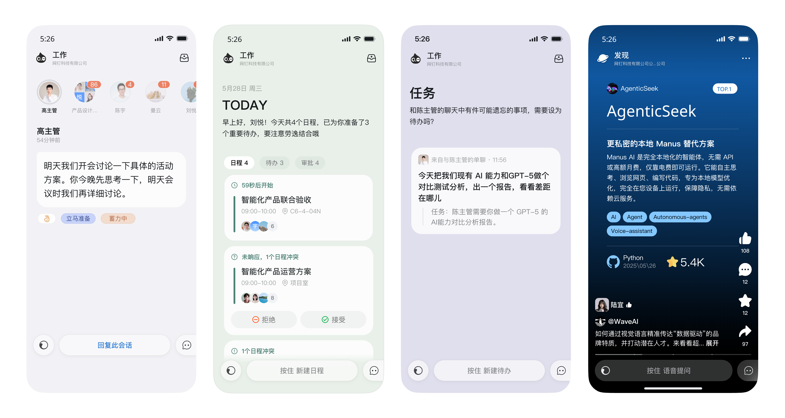
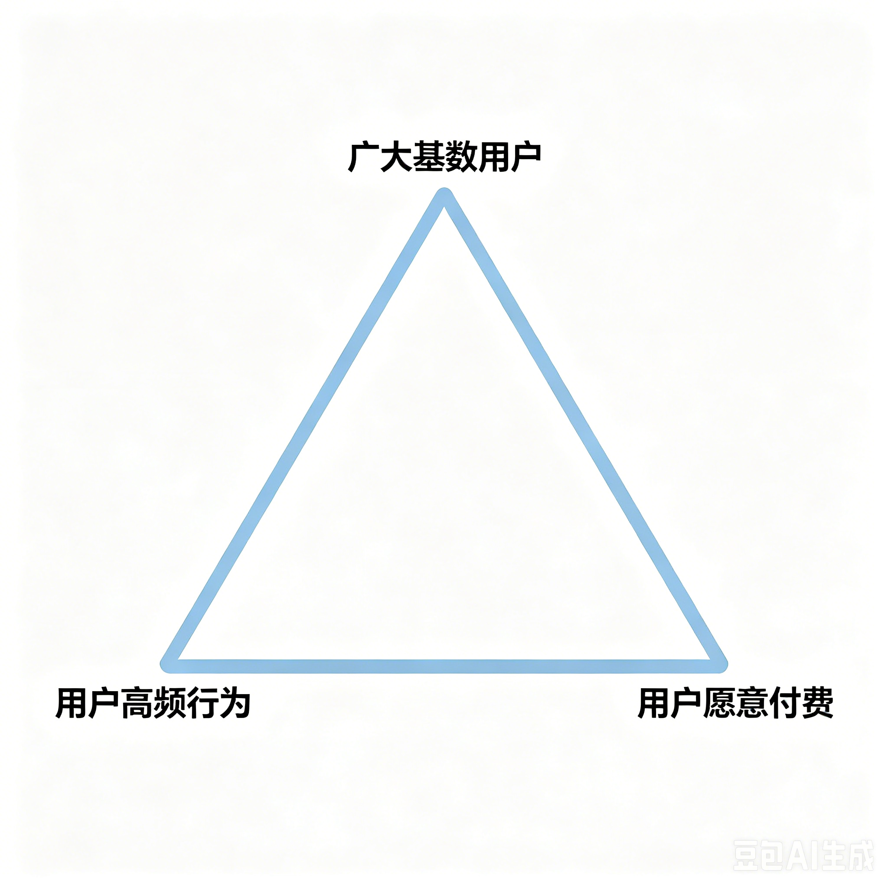
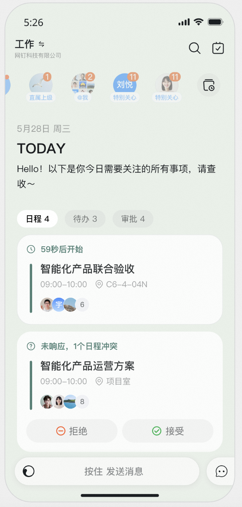
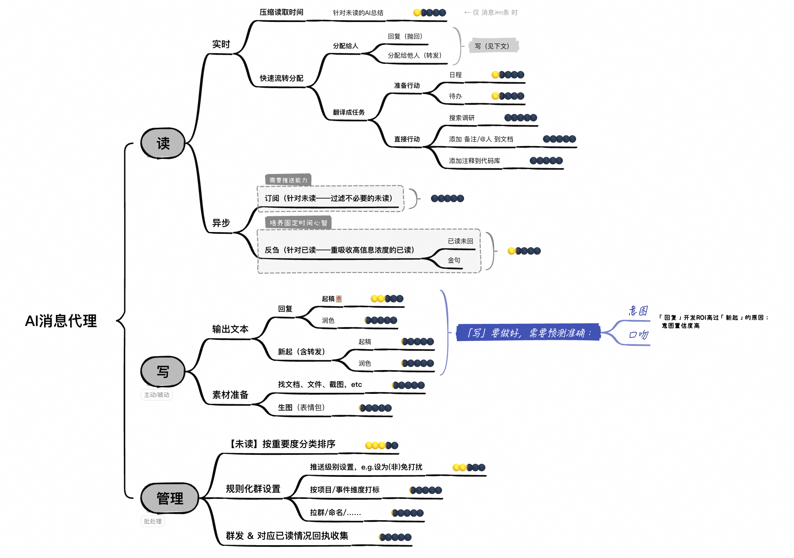
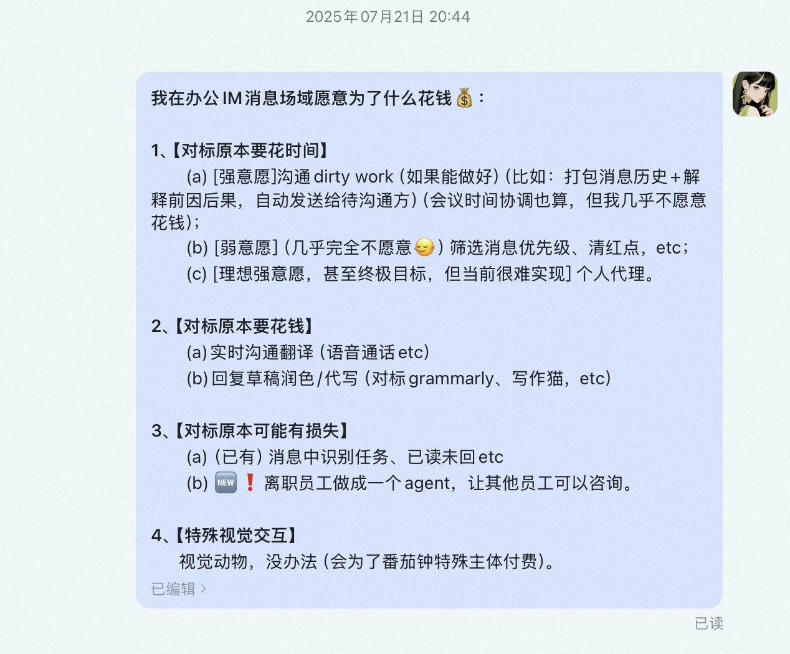
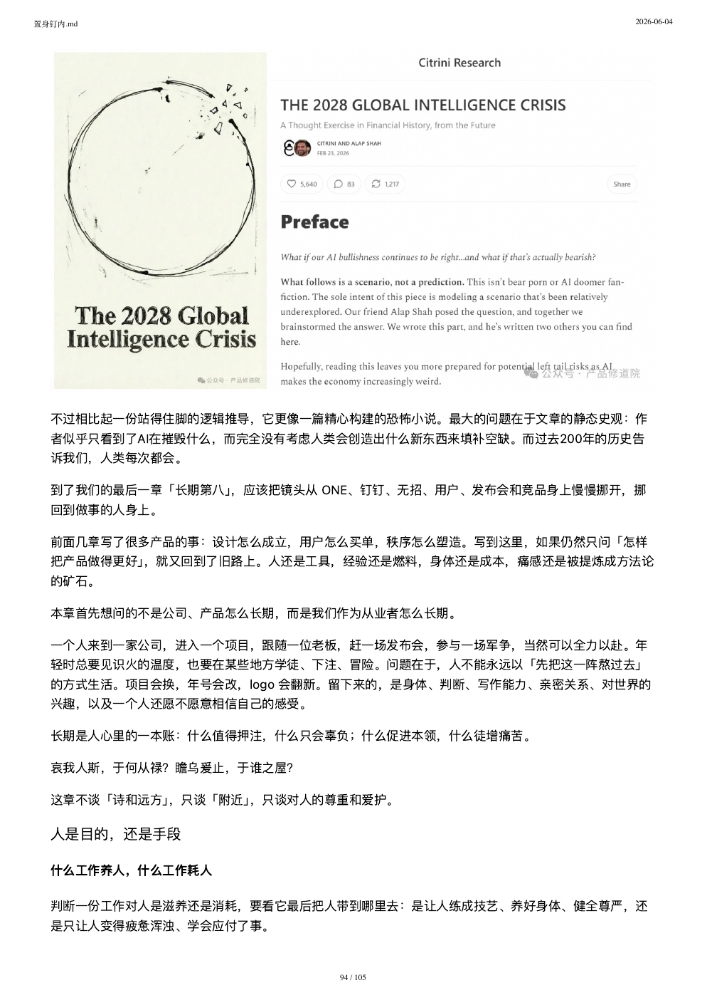

# 我读完 105 页《置身钉内》，最扎心的不是 ONE 失败了

> 日期：2026-06-05

大家好，我是 cxuan，一个和 AI Agent 互相折磨的 builder。

昨天我读完了一份 105 页的 PDF，名字叫《置身钉内》。

它讲的是钉钉 ONE。

按文档里的说法，ONE 是无招回归后，钉钉主推的 AI 原生项目。2025 年 4 月开始孕育，8 月 25 日发布会公开，巅峰 DAU 稳定在 300 万左右。

如果只看这个介绍，它很容易被写成一篇产品复盘：

一个 AI 工作信息流。

一个专属工作秘书。

一个把“人找事”变成“事找人”的新入口。

但读完整份文档，我最强烈的感受是：

ONE 最扎心的地方，不是它失败了。

而是它差一点就把 AI 办公产品里最难的问题都撞了一遍。

不是模型，不是界面，不是卡片，也不只是钉钉。

而是一个更底层的问题：

当 AI 进入工作流，它到底是在帮人掌握工作，还是让工作更早地掌握人？

## ONE 想做的事，其实很诱人

先说公道话。

ONE 的发心并不差。

钉钉本来就有组织关系、消息、日程、会议、审批、待办、文档这些东西。它不是一个单纯的聊天机器人，也不是一个漂在浏览器旁边的 AI 侧边栏。

它在真实工作现场里。

这件事很重要。

因为 AI 如果要真正帮人做事，只靠模型会聊天是不够的。它需要知道你在哪个组织里，你和谁协作，哪条消息重要，哪个会议后面有待办，哪个审批卡住了项目。

这就是钉钉的牌。

它手里有 context。

所以 ONE 最早那个想法是成立的：

把散落在钉钉各处的工作信息重新组织起来，让 AI 先替你多看一步。

早上打开，它告诉你今天要关注什么。

开完一个长会，它帮你从一堆未读里捞出重点。

下班前，它帮你检查有没有漏回、漏跟、漏处理的事。

这个方向，一点都不土。

甚至很前沿。

同一时期，海外很多 AI 产品也在往主动服务走。不是“你问我答”，而是系统在你没有提问前，就开始基于上下文做准备。

问题是，有 context 不等于有产品。

更不等于有正确的产品。

## 第一个洞，是发心太多

这份 PDF 里反复讲一个词：发心。

我理解成产品最开始为什么出发。

ONE 的发心有好几层。

它想帮用户减负。

它想让钉钉在 AI 时代重新变年轻。

它想给无招回归后的组织打一场新仗。

它也想找到商业化和 token 消耗的场景。

每一条单看都有道理。

合在一起，就开始拧巴。

一个产品同时想要大 DAU、高频行为、用户愿意付费，还想服务管理者、服务普通员工、承接发布会、贡献集团叙事，这基本就是不可能三角。

文档里有一张图很直接。

广大基数用户，意味着产品要轻，要泛，要高频。

高频工作行为，意味着它要进入消息、日程、待办、会议。

用户愿意付费，意味着它要解决更深、更具体、更贴业务的问题。

问题就在这里。

轻的东西，不一定痛。

高频的东西，老钉钉本来就能做。

深的东西，又很容易变成客户定制。

ONE 卡在中间。

它想成为所有人的入口，又很难替任何一类人把一件事做深。

这是很多 AI 产品都会遇到的问题。

一开始总觉得自己可以是入口。

后来才发现，入口是结果，不是起点。

你先解决一个足够痛的问题，用户才愿意把入口让给你。

## 最大的矛盾，是替谁说话

ONE 真正的内在矛盾，不在技术，而在立场。

钉钉的底层基因，是发信人立场。

已读未读、DING、考勤、审批、强触达，这些东西解决的是组织管理里的确定性焦虑：

我说的话，对方到底看见没有？

我交代的事，到底有没有往前走？

这个逻辑过去成就了钉钉。

但 ONE 讲的是另一套故事：

AI 帮员工减负。

AI 帮收信人过滤噪音。

AI 让重要的事自己浮上来。

听起来是体贴的。

可一旦它进入钉钉的旧规则，味道就变了。

最典型的就是已读。

在传统消息列表里，用户可以先看到群名、发信人、last message，然后决定要不要点进去。

这中间有一层缓冲。

这层缓冲对打工人非常重要。

因为不是每条消息都适合立刻签收。

有些要等会后再回，有些要先确认口径，有些要组织一下语言，有些只是现在没有心理准备。

但 ONE 的卡片把消息直接端到你眼前。

看见，就可能已读。

已读，就启动责任。

这就很要命。

原本的“主动服务”，体感上变成了“主动暴露”。

一个本来要帮用户减负的 AI 工作秘书，突然成了发信人的超级代理人。

这个判断很关键。

AI 办公产品不是越主动越好。

主动之前，先要问清楚：

这次主动，替谁节省时间？

又让谁提前承担责任？

## 卡片很好看，但工作不是刷内容

ONE 选择了卡片形态。

这个选择很合理，也很危险。

合理的地方在于，卡片很适合 demo。

它轻，漂亮，有 AI 感。

消息、日程、待办、审批、发现，都可以被整理成一张张卡片，像秘书把奏折摆到桌上。

但危险的地方在于：

工作不是消费内容。

划走一张短视频，视频不会找你要交付。

划走一张 Tinder 卡片，对方也不会等你给答复。

但钉钉里的每一张工作卡片背后，都可能有一个等你回复的同事、客户、老板、流程。

审批适合卡片。

字段规整，动作清楚，同意或拒绝。

日程勉强适合。

待办也适合。

但 IM 消息很难。

因为 IM 不只是“读内容”。

它还承担查找会话、判断关系、管理状态、延迟回应、标记未读、凭手感进入高频群聊等一堆隐性功能。

老系统未必优雅，但它可预期。

用户知道入口在哪，知道红点怎么看，知道点进去会发生什么。

新系统如果只是把老东西重新摆盘，用户不会迁移。

尤其在企业软件里，“够用”本身就是很强的惯性。

这就是 ONE 的尴尬。

它做了很多 AI 判断，但卡片前台呈现给用户的，往往只是一个更漂亮、更主动、但也更需要信任的新界面。

用户感知不到底层 AI 做了多少“网状逻辑缝合”。

他只感知到：

我为什么又要滑一张卡？

它会不会把我已读？

它总结得准不准？

它凭什么现在推给我？

## 真问题不是卡片，是读写管

文档里有一个变化，我觉得很重要。

团队后来逐渐意识到，设计不应该先从卡片开始，而应该先从用户动作开始。

用户在 IM 里到底做什么？

其实就是三件事：

读消息。

写消息。

管理消息。

这个拆法比“做一个 AI 卡片流”扎实多了。

因为它回到了用户行为。

读，可以帮用户压缩未读、判断重要性、反刍已读信息。

写，可以帮用户起草、润色、转述、翻译、分配。

管，可以帮用户识别群关系、设置优先级、沉淀规则。

这才是 AI 真正能发挥价值的地方。

不是让界面看起来更像未来。

而是把用户原来费脑子、费手、费注意力的动作拆出来，看哪一块真的能被 AI 接住。

文档里提到，后来 AI 回复取得了比较好的反馈，并且并入钉钉主端，成为灵动回复。

这很有意思。

一个宏大的 AI 新入口没有完全跑出来，反而是一个更小、更具体、更贴近用户动作的能力被留下了。

这可能才是很多 AI 产品的真实路径。

先别急着当操作系统。

先把一个高频动作做得足够好。

## 用户说好，不一定是真的好

PDF 的用户章节，是我觉得最值得产品经理反复看的部分。

它把用户分得很细。

共创用户，不等于真实用户。

老板用户，不等于普通员工。

内测玩家，不等于正式服玩家。

会夸你的用户，也不一定会为你迁移工作流。

这件事放在 ToB 里尤其明显。

付钱的人、使用的人、被影响的人，经常不是同一群人。

老板买单，员工使用。

管理员开权限，一线承受流程变化。

发信人获得确定性，收信人承担响应压力。

所以判断用户是否接受一个产品，不能只听他说“挺好”。

要看他愿意付出什么。

愿不愿意多点一次。

愿不愿意改习惯。

愿不愿意把团队流程交出来。

愿不愿意承担误判风险。

愿不愿意从老钉钉迁移到 ONE。

用户最诚实的回答，不在嘴上，在成本里。

这一点太重要了。

很多 AI 产品调研时都会听到一句话：

这个方向有价值。

这句话几乎没用。

方向有价值，和用户愿意每天用，中间隔着十万八千里。

学习内容当然有价值。

但用户正在处理消息、日程、待办时，突然被塞进一个发现流，他感受到的可能不是价值，而是打扰。

AI 主动服务当然有价值。

但用户还没准备好回复时，系统替他把消息读掉，他感受到的也不是智能，而是不安。

## 敏捷也会变成消耗

这份 PDF 后半段开始变得很沉。

因为它不再只讲产品，而是讲组织。

ONE 的节奏很快。

每天有包。

每天要有能看见的变化。

老板看到问题，团队快速响应。

这听起来像敏捷。

但文档里的判断很克制也很重：

敏捷如果服务于学习，会让产品更快接近真实问题。

敏捷如果服务于证明，会让团队更快产生变化，也更难承认方向需要重来。

这个区别太真实了。

真正难的东西，往往不适合每天截图汇报。

比如个性化。

比如长期记忆。

比如权限、审计、失败恢复。

比如重要消息的反馈闭环。

比如让系统逐渐学会“对我来说什么重要”。

这些东西不容易当天显影。

它们没有一个漂亮的按钮，也很难晚上拿给老板说，你看，今天又变了。

但它们决定 AI 工作产品能不能走远。

如果一个团队每天都在动，却没有更接近正确问题，那不叫敏捷。

叫奔波。

## 钉钉没看错终局

读到后面，我反而不觉得钉钉的问题是看错方向。

它没有看错。

企业 AI 的核心，确实是组织上下文、工作流、权限、入口和执行闭环。

钉钉手里也确实有资产。

IM、组织架构、审批、日程、会议、表格、低代码、阿里云、通义模型，还有大量企业客户。

这些都是真东西。

文档里把钉钉、飞书、企业微信、Google、Slack 放在一起看。

这个视角不错。

AI 没有凭空造出新地形。

大家都是在旧地形上重新开战。

钉钉的底盘，是组织确定性。

飞书的底盘，是知识和结构化协作。

企业微信的底盘，是微信客户连接。

Google 的底盘，是 Workspace。

Slack 的底盘，是企业对话现场和 Salesforce 数据。

旧基因决定新打法。

钉钉自然会走向组织推进、主动服务、沟通即执行。

这条路没错。

问题是，终局叙事不能替代中局战斗。

你可以看见 Agent OS。

但你要先赢下一个个小仗。

消息能不能处理好。

日程能不能闭环。

会议能不能变待办。

表格能不能接业务系统。

知识问答能不能可靠。

用户能不能放心把一类工作交给你。

如果这些还没站稳，就急着宣布自己是未来，产品会飘。

发布会可以点火。

但真正让用户留下来的，永远是可交付的工作流。

## 最后还是回到人

《置身钉内》最后一章，镜头从 ONE、钉钉、无招、竞品和发布会，慢慢挪回到做事的人身上。

这也是我觉得它最有价值的地方。

因为 AI 产品写到最后，如果只剩下“如何更高效”“如何更敏捷”“如何更快交付”，人就又变成了燃料。

文档里有一张关于长期的页面。

一个组织当然可以高压。

一个项目当然可以冲刺。

一个人也当然可以为了某件事燃烧一段时间。

问题是，燃烧之后有没有长出东西。

有没有长出判断。

有没有长出手艺。

有没有长出更稳定的内心。

有没有更理解用户、系统、组织和自己。

如果一段工作只是把人烧掉，没有让人变强，那这段燃烧就要重新估价。

这也是我读完这份 PDF 后最想记住的一句话：

好的 AI 工作产品，不是让系统更早发现工作。

而是让用户更好掌握工作。

这句话可以送给 ONE。

也可以送给所有正在做 AI Agent、AI 办公、AI 工作流的人。

不要只问模型能不能做。

还要问：

它替谁做？

它让谁承担代价？

它有没有增加用户的掌控感？

它是在让人更自由，还是让系统更会催人？

ONE 未必是一个失败样本。

它更像一场昂贵的现场实验。

它证明了钉钉确实站在企业 AI 的关键入口旁边。

也证明了 AI 办公产品真正难的地方，从来不只是把模型接进工作流。

而是让模型进入工作流以后，仍然尊重人的边界、节奏、责任和判断。

这件事，比做一张漂亮卡片难多了。
